# 学生信息管理系统（SISM）

---

# 一、系统分析

## 1.1 项目背景

随着高校学生数量的不断增长，传统的人工管理方式已无法满足高效、准确管理学生信息的需求。学生信息管理系统旨在通过信息化手段，实现学生数据的集中管理，提高管理人员的工作效率，降低人工操作带来的错误率。

## 1.2 需求描述

本系统是一个基于 B/S 架构的 Web 应用，管理员通过浏览器访问系统，完成学生信息的增删改查操作。系统采用 Java Web 核心技术（Servlet、JSP）实现，数据存储使用 MySQL 数据库进行持久化。

### 1.2.1 功能需求

| 序号 | 功能模块 | 需求描述 |
|------|----------|----------|
| 1 | 用户登录 | 预设管理员账号（admin / 123456），验证成功后进入系统首页 |
| 2 | 学生列表展示 | 以表格形式展示所有学生的学号、姓名、性别、年龄、班级信息，支持分页 |
| 3 | 添加学生 | 录入学生信息，验证学号唯一性（6位数字），必填项非空校验 |
| 4 | 修改学生 | 根据学号查询并修改学生的姓名、性别、年龄、班级信息 |
| 5 | 删除学生 | 根据学号删除学生，操作前需确认提示 |
| 6 | 查询学生 | 支持按学号或姓名模糊查询 |
| 7 | 成绩管理 | 录入、修改、删除学生各科成绩 |
| 8 | 密码修改 | 管理员可修改登录密码 |
| 9 | 退出登录 | 销毁当前会话，返回登录页面 |
| 10 | 异常处理 | 参数错误、空指针、数字格式异常等跳转至友好错误页面 |

### 1.2.2 非功能需求

- **性能需求**：系统响应时间应在 1 秒以内，支持分页展示大量数据。
- **安全需求**：登录状态通过 Session 维护，未登录用户无法访问内部页面；所有数据操作必须通过服务器端处理。
- **易用性需求**：界面简洁明了，操作流程符合用户习惯，提供表单校验和错误提示。
- **可维护性需求**：代码结构清晰，采用 MVC 分层架构，便于后续功能扩展。

## 1.3 用例图

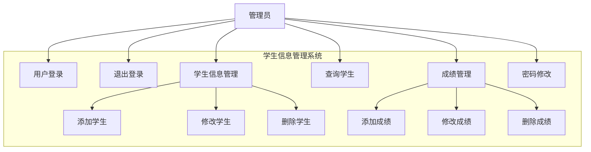

## 1.4 业务流程图

### 1.4.1 登录业务流程

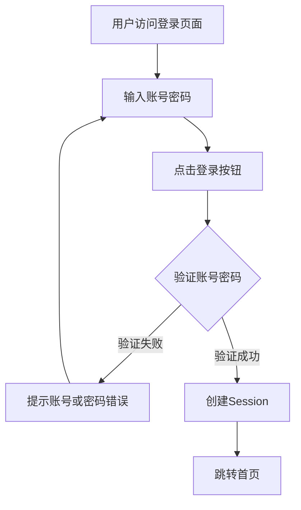

### 1.4.2 添加学生业务流程

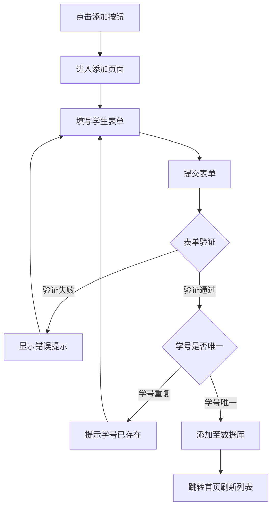

### 1.4.3 修改学生业务流程

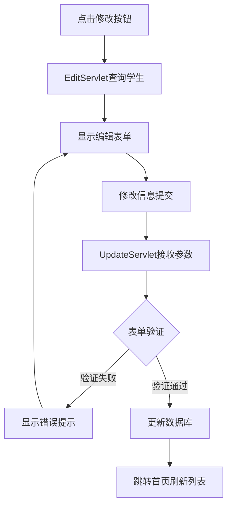

### 1.4.4 删除学生业务流程

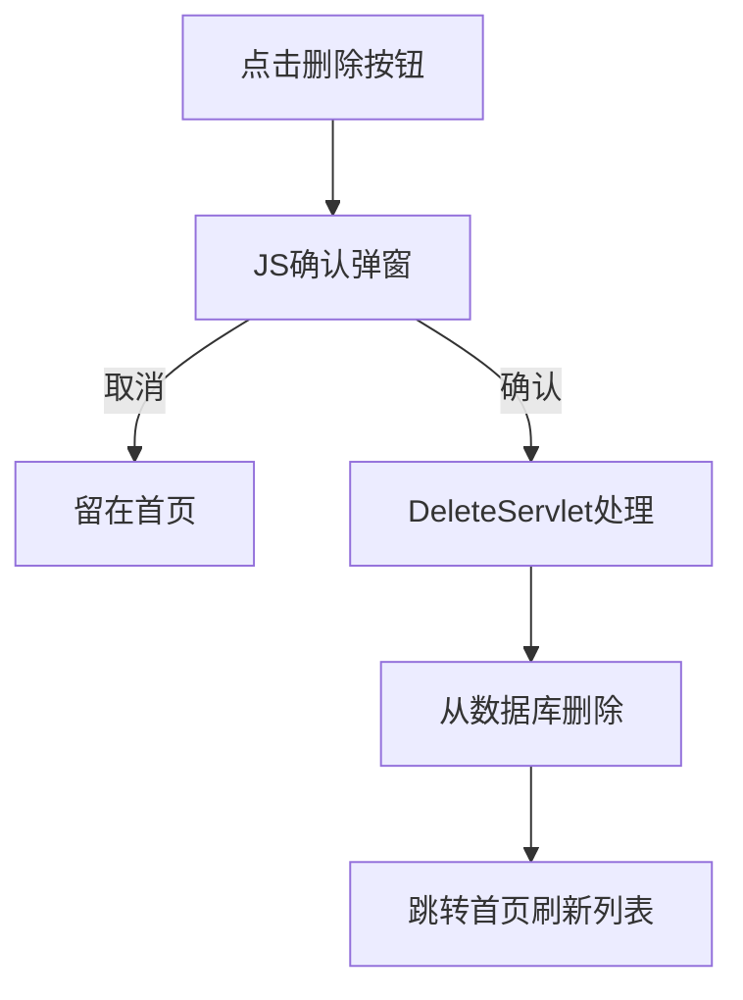

---

# 二、系统设计

## 2.1 系统概述

学生信息管理系统（SISM）采用经典的 MVC（Model-View-Controller）分层架构，基于 Java Servlet 和 JSP 技术实现。系统使用 MySQL 数据库进行数据持久化存储，通过 JDBC 进行数据库操作。

### 技术栈

| 层级 | 技术 | 说明 |
|------|------|------|
| 前端 | HTML + CSS + JSP | JSP 负责页面渲染，CSS 负责样式美化 |
| 控制层 | Jakarta Servlet | 处理 HTTP 请求，进行业务逻辑调用 |
| 模型层 | Java POJO + JDBC | Student/Score 实体类，JDBC DAO 层 |
| 数据库 | MySQL 8.0 | 关系型数据库持久化存储 |
| 构建工具 | Maven | 项目依赖管理和打包 |
| 服务器 | Tomcat 9.0+ | Jakarta EE 10 兼容的 Servlet 容器 |

## 2.2 功能设计

### 2.2.1 系统功能模块图

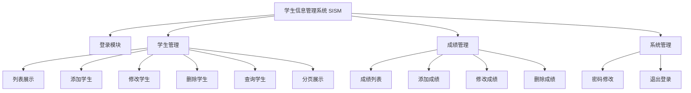

### 2.2.2 登录功能活动图

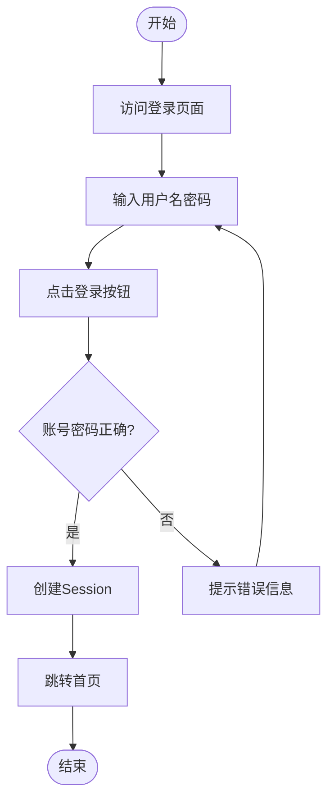

### 2.2.3 添加学生功能活动图

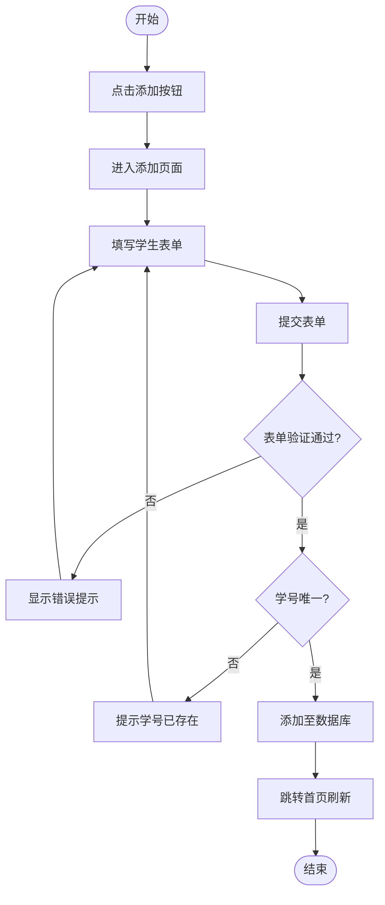

## 2.3 类图设计

### 2.3.1 系统整体类图

```mermaid
classDiagram
    class Student {
        -String studentId
        -String name
        -String gender
        -int age
        -String clazz
        +getStudentId() String
        +setStudentId(String)
        +getName() String
        +setName(String)
        +getGender() String
        +setGender(String)
        +getAge() int
        +setAge(int)
        +getClazz() String
        +setClazz(String)
        +toString() String
    }
    
    class Score {
        -int id
        -String studentId
        -String courseName
        -double score
        -String studentName
        +getId() int
        +setId(int)
        +getStudentId() String
        +setStudentId(String)
        +getCourseName() String
        +setCourseName(String)
        +getScore() double
        +setScore(double)
        +getStudentName() String
        +setStudentName(String)
    }
    
    class StudentDataStore {
        -StudentDataStore instance
        +getInstance() StudentDataStore
        +getAllStudents() List~Student~
        +getStudentsByPage(int, int) List~Student~
        +getStudentCount() int
        +searchStudents(String) List~Student~
        +getStudentById(String) Student
        +addStudent(Student) boolean
        +updateStudent(Student) boolean
        +deleteStudent(String) boolean
        +isStudentIdExists(String) boolean
    }
    
    class ScoreDataStore {
        -ScoreDataStore instance
        +getInstance() ScoreDataStore
        +getAllScores() List~Score~
        +getScoresByStudentId(String) List~Score~
        +getScoreById(int) Score
        +addScore(Score) boolean
        +updateScore(Score) boolean
        +deleteScore(int) boolean
    }
    
    class AdminDataStore {
        -AdminDataStore instance
        +getInstance() AdminDataStore
        +validateLogin(String, String) boolean
        +changePassword(String, String) boolean
    }
    
    class DBUtil {
        +getConnection() Connection
        +close(Connection, Statement, ResultSet)
        +initDatabase()
    }
    
    class LoginServlet {
        +doGet(HttpServletRequest, HttpServletResponse)
        +doPost(HttpServletRequest, HttpServletResponse)
    }
    
    class IndexServlet {
        +doGet(HttpServletRequest, HttpServletResponse)
    }
    
    class AddStudentServlet {
        +doGet(HttpServletRequest, HttpServletResponse)
        +doPost(HttpServletRequest, HttpServletResponse)
        +validateStudent(...) String
    }
    
    class EditStudentServlet {
        +doGet(HttpServletRequest, HttpServletResponse)
    }
    
    class UpdateStudentServlet {
        +doPost(HttpServletRequest, HttpServletResponse)
    }
    
    class DeleteStudentServlet {
        +doGet(HttpServletRequest, HttpServletResponse)
    }
    
    class SearchServlet {
        +doGet(HttpServletRequest, HttpServletResponse)
    }
    
    class ChangePasswordServlet {
        +doGet(HttpServletRequest, HttpServletResponse)
        +doPost(HttpServletRequest, HttpServletResponse)
    }
    
    class ScoreListServlet {
        +doGet(HttpServletRequest, HttpServletResponse)
    }
    
    class AddScoreServlet {
        +doGet(HttpServletRequest, HttpServletResponse)
        +doPost(HttpServletRequest, HttpServletResponse)
    }
    
    class EditScoreServlet {
        +doGet(HttpServletRequest, HttpServletResponse)
    }
    
    class UpdateScoreServlet {
        +doPost(HttpServletRequest, HttpServletResponse)
    }
    
    class DeleteScoreServlet {
        +doGet(HttpServletRequest, HttpServletResponse)
    }
    
    StudentDataStore --> Student
    ScoreDataStore --> Score
    StudentDataStore --> DBUtil
    ScoreDataStore --> DBUtil
    AdminDataStore --> DBUtil
    LoginServlet --> AdminDataStore
    IndexServlet --> StudentDataStore
    AddStudentServlet --> StudentDataStore
    EditStudentServlet --> StudentDataStore
    UpdateStudentServlet --> StudentDataStore
    DeleteStudentServlet --> StudentDataStore
    SearchServlet --> StudentDataStore
    ChangePasswordServlet --> AdminDataStore
    ScoreListServlet --> ScoreDataStore
    AddScoreServlet --> ScoreDataStore
    EditScoreServlet --> ScoreDataStore
    UpdateScoreServlet --> ScoreDataStore
    DeleteScoreServlet --> ScoreDataStore
```

## 2.4 数据库设计

### 2.4.1 E-R 图

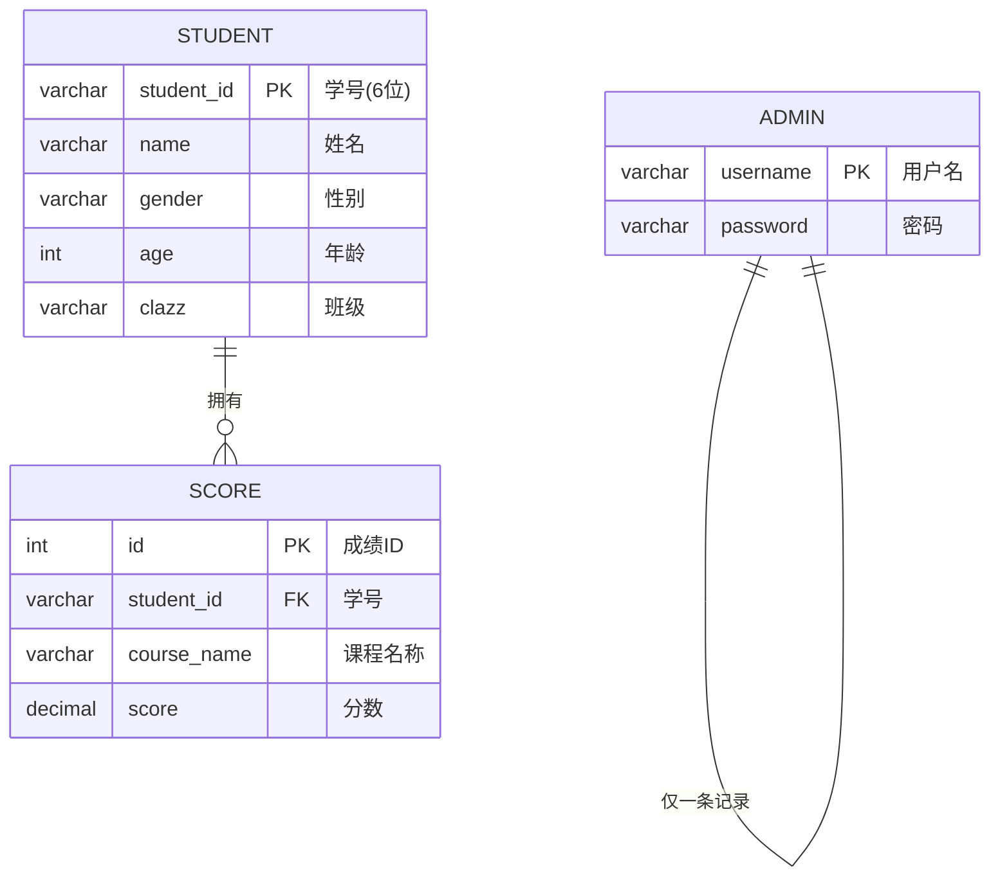

### 2.4.2 数据表设计

#### 表 1：admin（管理员表）

| 字段名 | 数据类型 | 长度 | 是否为空 | 说明 |
|--------|----------|------|----------|------|
| username | VARCHAR | 50 | 否 | 主键，用户名 |
| password | VARCHAR | 50 | 否 | 登录密码 |

#### 表 2：student（学生表）

| 字段名 | 数据类型 | 长度 | 是否为空 | 说明 |
|--------|----------|------|----------|------|
| student_id | VARCHAR | 6 | 否 | 主键，学号（6位数字） |
| name | VARCHAR | 50 | 否 | 学生姓名 |
| gender | VARCHAR | 4 | 否 | 性别（男/女） |
| age | INT | - | 否 | 年龄（正整数） |
| clazz | VARCHAR | 50 | 否 | 班级名称 |

#### 表 3：score（成绩表）

| 字段名 | 数据类型 | 长度 | 是否为空 | 说明 |
|--------|----------|------|----------|------|
| id | INT | - | 否 | 主键，自增 |
| student_id | VARCHAR | 6 | 否 | 外键，关联学生 |
| course_name | VARCHAR | 50 | 否 | 课程名称 |
| score | DECIMAL | 5,2 | 否 | 分数（0-100） |

## 2.5 时序图设计

### 2.5.1 登录验证时序图

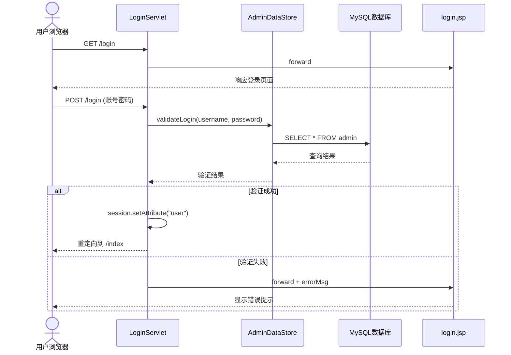

### 2.5.2 添加学生时序图

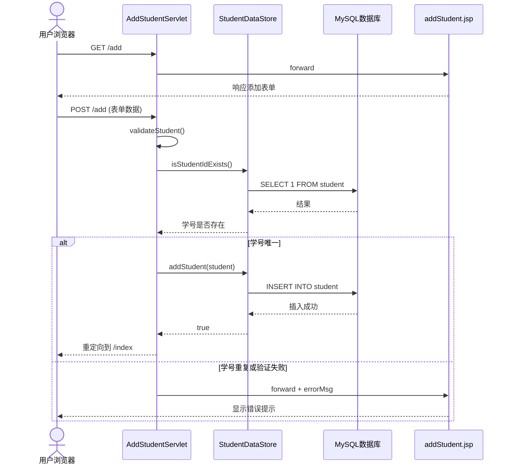

---

# 三、系统实现

## 3.1 项目结构

```
SISM/
├── pom.xml                          # Maven 项目配置文件
└── src/
    └── main/
        ├── java/com/lggyx/sism/
        │   ├── listener/
        │   │   └── AppContextListener.java    # 应用启动监听器
        │   ├── model/
        │   │   ├── Student.java               # 学生实体类
        │   │   └── Score.java                 # 成绩实体类
        │   ├── dao/
        │   │   ├── StudentDataStore.java      # 学生数据访问对象(JDBC)
        │   │   ├── ScoreDataStore.java        # 成绩数据访问对象(JDBC)
        │   │   └── AdminDataStore.java        # 管理员数据访问对象(JDBC)
        │   ├── servlet/
        │   │   ├── LoginServlet.java          # 登录验证
        │   │   ├── LogoutServlet.java         # 退出登录
        │   │   ├── IndexServlet.java          # 首页/列表展示(分页)
        │   │   ├── AddStudentServlet.java     # 添加学生
        │   │   ├── EditStudentServlet.java    # 编辑页面数据准备
        │   │   ├── UpdateStudentServlet.java  # 更新学生
        │   │   ├── DeleteStudentServlet.java  # 删除学生
        │   │   ├── SearchServlet.java         # 模糊查询
        │   │   ├── ChangePasswordServlet.java # 密码修改
        │   │   ├── ScoreListServlet.java      # 成绩列表
        │   │   ├── AddScoreServlet.java       # 添加成绩
        │   │   ├── EditScoreServlet.java      # 编辑成绩
        │   │   ├── UpdateScoreServlet.java    # 更新成绩
        │   │   └── DeleteScoreServlet.java    # 删除成绩
        │   └── util/
        │       └── DBUtil.java                # 数据库连接工具类
        ├── resources/
        │   └── META-INF/
        │       ├── beans.xml
        │       └── persistence.xml
        └── webapp/
            ├── WEB-INF/
            │   └── web.xml            # Web 应用配置
            ├── css/
            │   └── style.css          # 公共样式文件
            ├── login.jsp              # 登录页面
            ├── index.jsp              # 学生列表首页(含查询/分页)
            ├── addStudent.jsp         # 添加学生表单
            ├── editStudent.jsp        # 修改学生表单
            ├── scoreList.jsp          # 成绩列表页
            ├── addScore.jsp           # 添加成绩表单
            ├── editScore.jsp          # 修改成绩表单
            ├── changePassword.jsp     # 密码修改页面
            └── error.jsp              # 错误提示页面
```

## 3.2 主要代码说明

### 3.2.1 实体类

**Student.java**：定义学生五个属性（学号、姓名、性别、年龄、班级），实现 `Serializable` 接口。

**Score.java**：定义成绩属性（id、studentId、courseName、score、studentName），用于成绩管理。

### 3.2.2 数据库连接 DBUtil.java

- 使用 `com.mysql.cj.jdbc.Driver` 驱动连接 MySQL
- 连接 URL：`jdbc:mysql://localhost:3306/sism`
- 提供 `getConnection()`、`close()` 及 `initDatabase()` 方法
- `initDatabase()` 自动创建 `student`、`admin`、`score` 三张表并插入示例数据

### 3.2.3 应用启动监听器 AppContextListener.java

- 实现 `ServletContextListener`，标注 `@WebListener`
- `contextInitialized()` 在 Tomcat 启动时自动调用 `DBUtil.initDatabase()`
- **确保任何请求到达前数据库已初始化完毕**

### 3.2.4 数据访问层 DAO

**StudentDataStore.java**：
- JDBC 实现学生增删改查
- 新增 `getStudentsByPage(page, pageSize)` 分页查询
- 新增 `searchStudents(keyword)` 模糊查询（学号/姓名 LIKE）
- 新增 `getStudentCount()` 统计总数

**AdminDataStore.java**：
- `validateLogin(username, password)` 验证登录
- `changePassword(username, newPassword)` 修改密码

**ScoreDataStore.java**：
- 成绩的增删改查，支持 JOIN 查询学生姓名

### 3.2.5 Servlet 控制层

**LoginServlet.java**：
- 使用 `AdminDataStore.validateLogin()` 查询数据库验证
- 验证成功创建 Session，失败回显错误信息

**IndexServlet.java**：
- 分页逻辑：每页 5 条，计算总页数
- 将当前页、总页数、总记录数存入 request 域

**SearchServlet.java**：
- 接收 keyword 参数，调用 `searchStudents()` 模糊查询
- 查询结果不分页，直接显示

**ChangePasswordServlet.java**：
- 验证原密码正确性
- 新密码不少于 6 位，两次输入一致
- 修改成功后销毁 Session 要求重新登录

### 3.2.6 前端页面关键逻辑

**index.jsp**：
- 顶部搜索框（学号/姓名模糊查询）
- 分页导航（上一页/下一页/页码跳转）
- "成绩管理"和"修改密码"快捷入口
- 删除前 JavaScript `confirm()` 确认

**scoreList.jsp**：成绩列表展示，支持修改/删除

**changePassword.jsp**：原密码 + 新密码 + 确认密码三栏表单

## 3.3 测试用例表

### 3.3.1 登录功能测试

| 用例编号 | 用例名称 | 前置条件 | 输入数据 | 预期结果 | 实际结果 | 测试状态 |
|----------|----------|----------|----------|----------|----------|----------|
| TC-001 | 正确账号密码登录 | MySQL已启动，数据库已初始化 | admin / 123456 | 登录成功，跳转首页 | 待测试 | - |
| TC-002 | 错误密码登录 | 同上 | admin / wrong | 登录失败，提示错误 | 待测试 | - |
| TC-003 | 空用户名 | 同上 | 空 / 123456 | HTML5阻止提交 | 待测试 | - |
| TC-004 | 未登录访问首页 | 未登录 | 直接访问 /index | 重定向到登录页 | 待测试 | - |

### 3.3.2 学生管理测试

| 用例编号 | 用例名称 | 前置条件 | 输入数据 | 预期结果 | 实际结果 | 测试状态 |
|----------|----------|----------|----------|----------|----------|----------|
| TC-005 | 正常添加学生 | 已登录 | 202313/钱七/男/20/计算机1班 | 添加成功，首页显示 | 待测试 | - |
| TC-006 | 学号重复 | 已登录 | 202301/... | 提示学号已存在 | 待测试 | - |
| TC-007 | 学号非6位 | 已登录 | 12345/... | 提示学号格式错误 | 待测试 | - |
| TC-008 | 分页展示 | 已登录，12条数据 | 访问 /index | 显示第1页5条+分页导航 | 待测试 | - |
| TC-009 | 模糊查询 | 已登录 | 关键字"张" | 显示匹配的学生 | 待测试 | - |
| TC-010 | 正常删除 | 已登录 | 点击删除并确认 | 学生从列表移除 | 待测试 | - |

### 3.3.3 成绩管理测试

| 用例编号 | 用例名称 | 前置条件 | 输入数据 | 预期结果 | 实际结果 | 测试状态 |
|----------|----------|----------|----------|----------|----------|----------|
| TC-011 | 添加成绩 | 已登录 | 202301/数学/85.5 | 添加成功 | 待测试 | - |
| TC-012 | 成绩超范围 | 已登录 | 202301/数学/105 | 提示0-100之间 | 待测试 | - |
| TC-013 | 删除成绩 | 已登录 | 点击删除并确认 | 成绩移除 | 待测试 | - |

### 3.3.4 密码修改测试

| 用例编号 | 用例名称 | 前置条件 | 输入数据 | 预期结果 | 实际结果 | 测试状态 |
|----------|----------|----------|----------|----------|----------|----------|
| TC-014 | 正常修改密码 | 已登录 | 原密码123456/新密码abc123/确认abc123 | 修改成功，要求重新登录 | 待测试 | - |
| TC-015 | 原密码错误 | 已登录 | 原密码wrong/... | 提示原密码错误 | 待测试 | - |
| TC-016 | 两次新密码不一致 | 已登录 | .../abc123/abc456 | 提示密码不一致 | 待测试 | - |
| TC-017 | 新密码太短 | 已登录 | .../123/123 | 提示不少于6位 | 待测试 | - |

## 3.4 运行结果说明

### 3.4.1 登录页面

- 中央登录框，含系统标题、用户名/密码输入框
- 登录失败显示红色错误提示

### 3.4.2 首页（学生列表页）

- 顶部导航栏含"学生信息管理系统"标题、"成绩管理"、"修改密码"、"退出登录"按钮
- 搜索框支持学号/姓名模糊查询
- 表格展示学号、姓名、性别、年龄、班级、操作
- 底部分页导航显示"共 X 条，第 N / M 页"

### 3.4.3 成绩管理页

- 成绩列表含学号、姓名、课程名、成绩
- 支持修改/删除成绩
- 可添加新成绩记录

### 3.4.4 密码修改页

- 三栏表单：原密码、新密码、确认新密码
- 修改成功后显示绿色提示并要求重新登录

## 3.5 部署说明

1. **环境准备**：JDK 17+、Maven 3.8+、Tomcat 9.0+、MySQL 8.0+
2. **数据库准备**：
   ```sql
   CREATE DATABASE sism CHARACTER SET utf8mb4 COLLATE utf8mb4_unicode_ci;
   ```
3. **编译打包**：`mvn clean package`
4. **部署运行**：将 WAR 包放入 Tomcat `webapps` 目录
5. **访问系统**：`http://localhost:8080/SISM-1.0-SNAPSHOT/login`
   - 默认账号：admin / 123456
6. **数据库配置**：如需修改连接信息，编辑 `DBUtil.java` 中的 URL/用户名/密码

---

# 四、可选功能实现说明

## 4.1 已实现的可选功能

| 序号 | 功能 | 实现说明 |
|------|------|----------|
| 1 | 学生信息查询 | 首页顶部搜索框，支持学号或姓名模糊查询（LIKE %keyword%） |
| 2 | 分页功能 | 首页列表每页5条，含上一页/下一页/页码跳转 |
| 3 | 密码修改 | 独立页面，验证原密码后修改，存入MySQL数据库 |
| 4 | 前端美化 | CSS统一风格：卡片式布局、按钮分类配色、表格hover效果 |
| 5 | 数据库持久化 | 全部数据（学生、管理员、成绩）存储于MySQL，JDBC操作 |
| 6 | 成绩管理 | 新增成绩实体和完整CRUD功能，外键关联学生表 |

## 4.2 数据库初始化机制

- **AppContextListener** 在 Tomcat 启动时自动执行 `DBUtil.initDatabase()`
- 自动创建 `admin`、`student`、`score` 三张表
- 自动插入默认管理员（admin/123456）和 12 条示例学生数据
- **无需手动执行 SQL 脚本**，首次部署即可使用

## 4.3 分页查询 SQL

```sql
-- 分页查询学生（每页5条）
SELECT * FROM student ORDER BY student_id LIMIT ? OFFSET ?;

-- 统计总数
SELECT COUNT(*) FROM student;
```

## 4.4 模糊查询 SQL

```sql
-- 按学号或姓名模糊查询
SELECT * FROM student WHERE student_id LIKE ? OR name LIKE ? ORDER BY student_id;
```
